<h1 align="center">Game4r.store</h1>

<p align="center">
  Plataforma completa de e-commerce para produtos gamers — web + mobile.
</p>


---

## Índice

- [Arquitetura do Sistema](#arquitetura-do-sistema)
- [Modelo de Dados](#modelo-de-dados)
- [Estrutura do Projeto](#estrutura-do-projeto)
- [Fluxo de Navegação](#fluxo-de-navegação)
- [Componentes da Interface](#componentes-da-interface)
- [Funcionalidades](#funcionalidades)
- [Pré-requisitos](#pré-requisitos)
- [Setup](#setup)
- [Rodar](#rodar)
- [API](#api)
- [Tech Stack](#tech-stack)

---

## Arquitetura do Sistema

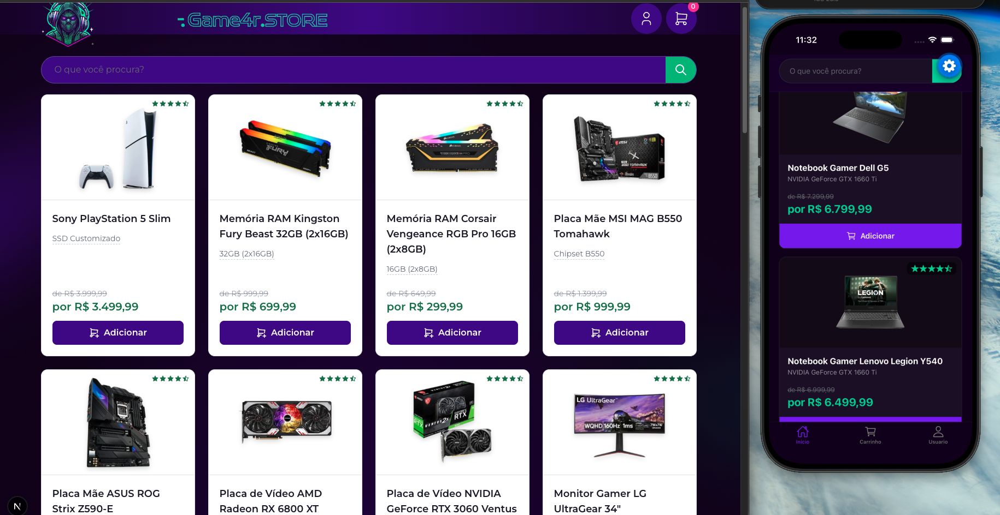

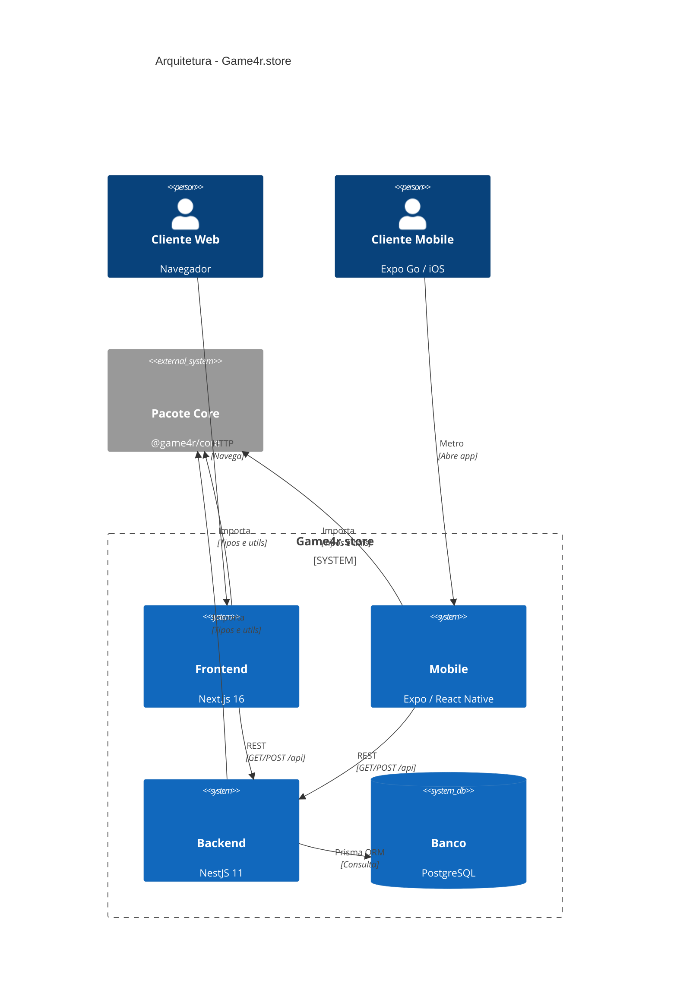

### Diagrama de Containers

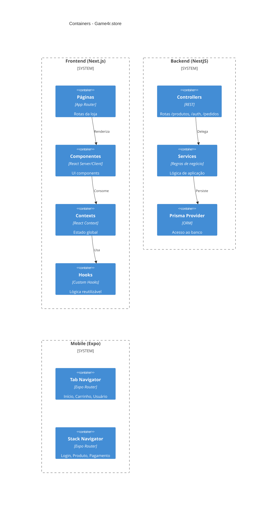

---

## Modelo de Dados

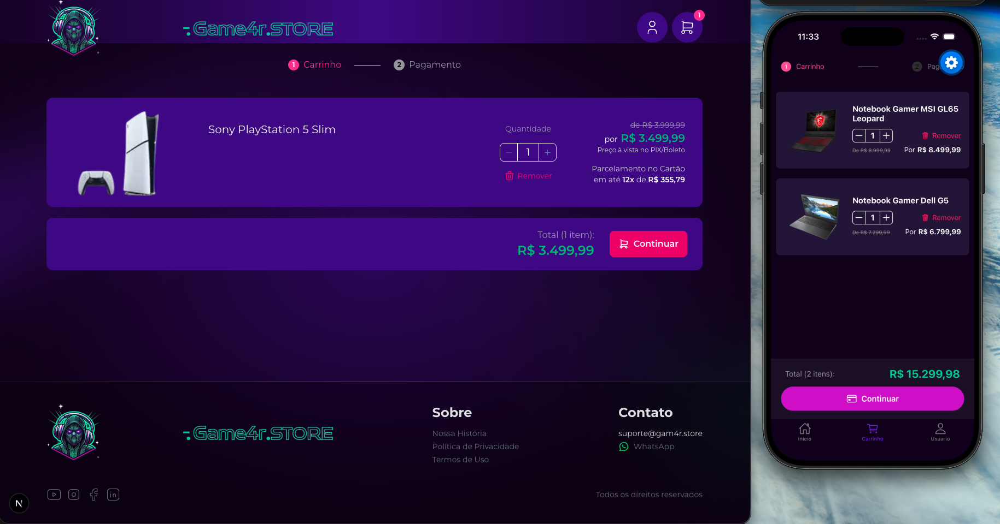

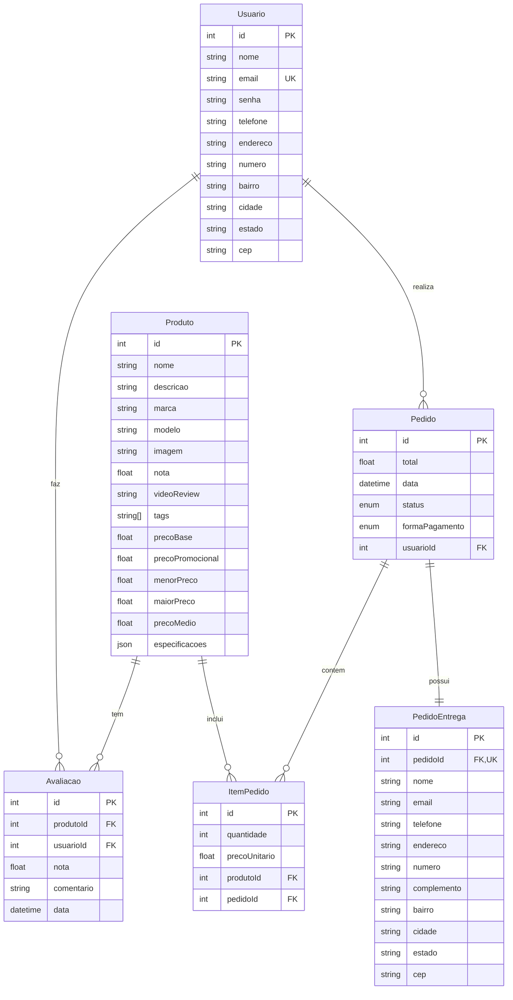

---

## Fluxo de Navegação

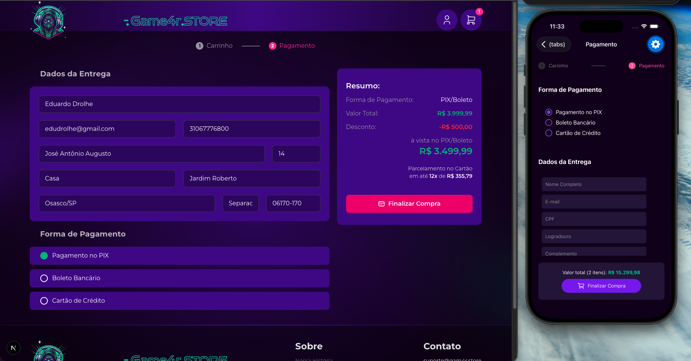

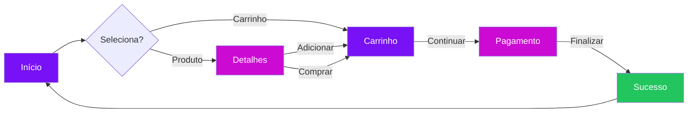

---

## Estrutura do Projeto

```
game4r.store/
├── apps/
│   ├── backend/              # API REST (NestJS)
│   │   ├── prisma/
│   │   │   ├── schema.prisma # Modelo de dados
│   │   │   ├── migrations/   # Migrations + seed
│   │   │   └── seed.ts       # 28 produtos iniciais
│   │   └── src/
│   │       ├── auth/         # Autenticação JWT
│   │       ├── db/           # Prisma provider
│   │       ├── produto/      # CRUD produtos
│   │       ├── pedido/       # Gestão de pedidos
│   │       └── avaliacao/    # Avaliações
│   │
│   ├── frontend/             # Loja web (Next.js 16)
│   │   └── src/
│   │       ├── app/          # App Router
│   │       │   ├── (paginas) # Páginas principais
│   │       │   └── checkout/ # Fluxo de compra
│   │       ├── components/   # UI components
│   │       │   ├── checkout/ # Carrinho, pagamento
│   │       │   ├── produto/  # Cards, banner, specs
│   │       │   ├── template/ # Header, footer
│   │       │   └── shared/   # NotaReview, etc.
│   │       └── data/         # Contexts + hooks
│   │
│   └── mobile/               # App mobile (Expo)
│       └── src/
│           ├── app/          # Expo Router
│           │   ├── (tabs)/   # Início, Carrinho, Usuário
│           │   └── (stack)/  # Produto, Login, Pagamento
│           ├── components/   # Mesma estrutura do frontend
│           └── data/         # Contexts + hooks
│
└── packages/
    └── core/                 # @game4r/core
        └── src/
            ├── constants/    # Produtos, parcelamento
            ├── produto/      # Tipos e classes
            └── utils/        # Moeda, filtrar, etc.
```

---

## Componentes da Interface

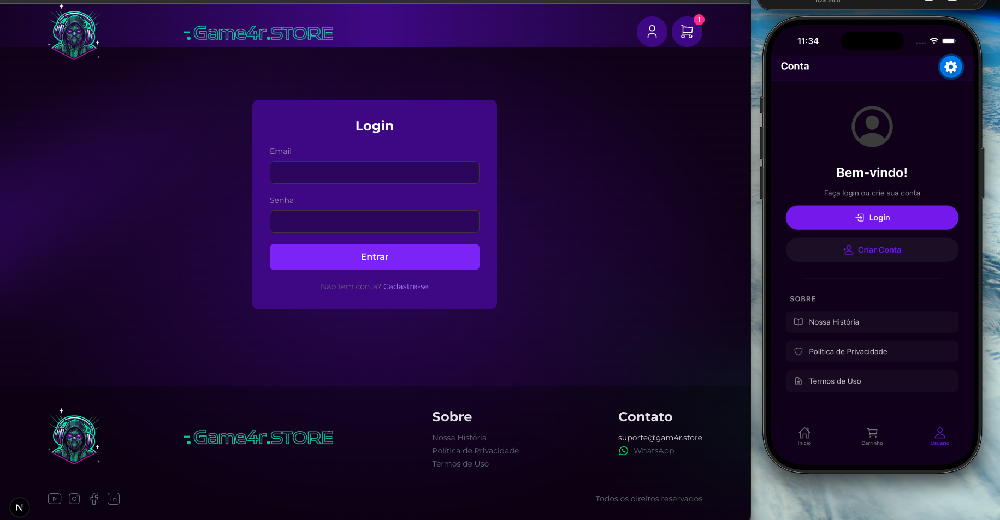

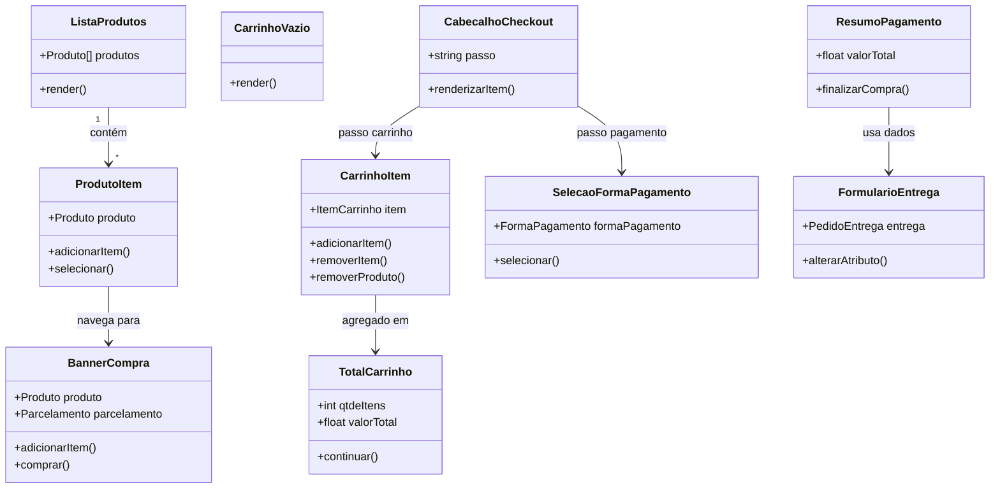

---

## Design System

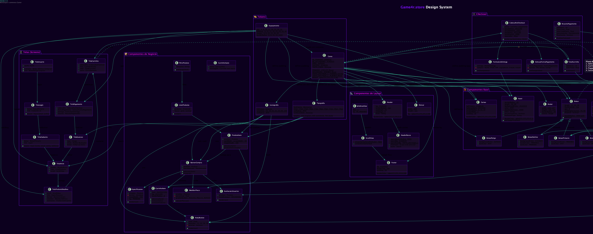

O design system do Game4r.store define a identidade visual completa do projeto, incluindo tokens (cores, tipografia, espaçamento, iconografia), componentes base (botões, inputs, cartões, badges), componentes de layout e componentes de negócio.

---

## Funcionalidades

- Catálogo de produtos com busca e filtro
- Carrinho de compras com persistência local
- Sistema de autenticação (cadastro/login)
- Checkout com PIX, Boleto e Cartão de Crédito
- Medidor de preço com comparação histórica
- Avaliações de usuários
- Design responsivo (web) e nativo (mobile)

---

## Pré-requisitos

- **Node.js** >= 20
- **PostgreSQL** rodando em `localhost:5432`
- **Xcode** (para iOS simulator)
- **Expo Go** (opcional, para testar no dispositivo físico)

---

## API

| Método | Rota | Descrição |
|--------|------|-----------|
| GET | `/produtos` | Lista todos os produtos |
| GET | `/produtos/:id` | Detalhes do produto |
| POST | `/auth/cadastrar` | Cadastro de usuário |
| POST | `/auth/login` | Login (retorna JWT) |
| POST | `/avaliacoes` | Criar avaliação |
| GET | `/avaliacoes/produto/:id` | Avaliações de um produto |
| GET | `/avaliacoes/produto/:id/resumo` | Resumo das avaliações |
| POST | `/pedidos` | Criar novo pedido |
| GET | `/pedidos` | Listar pedidos do usuário |
| DELETE | `/pedidos/:id` | Cancelar pedido |

---

## Tech Stack

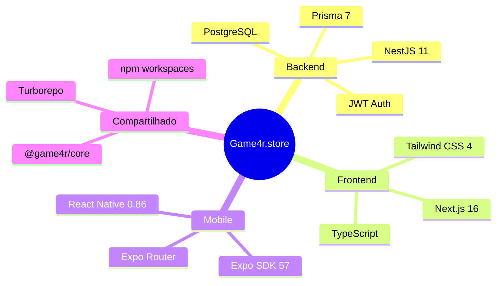

---

<p align="center">
  Feito por <a href="https://github.com/eduardodrolhe">Eduardo Drolhe</a>
</p>
